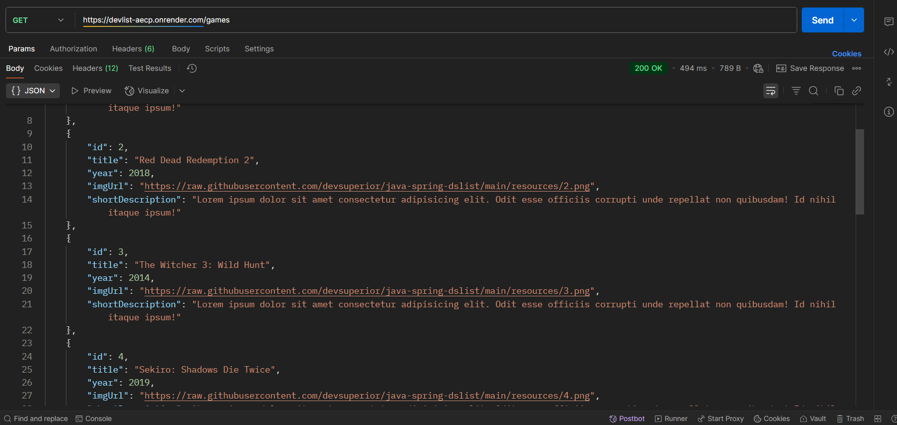
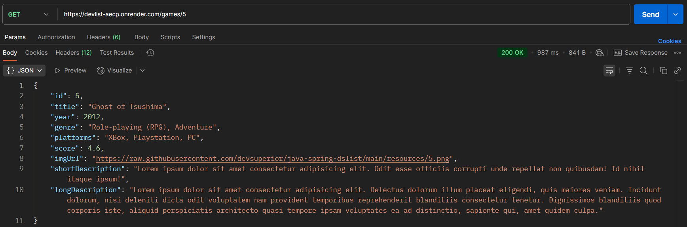
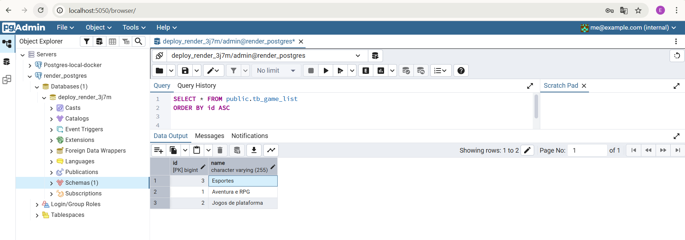
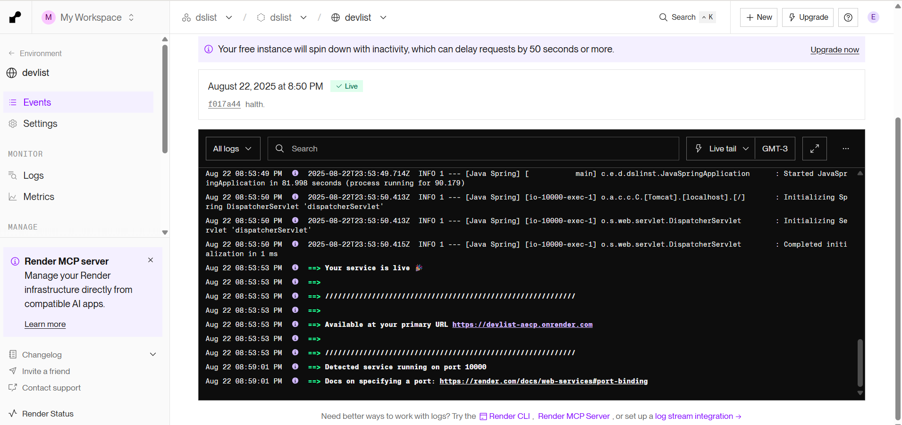
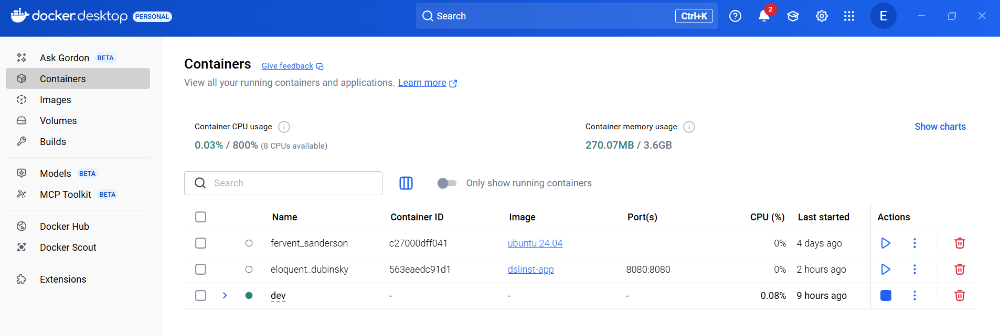

# DSList - Lista de Jogos por Categoria

> Um sistema simples para gerenciar uma lista de jogos categorizados, com backend em Java/Spring Boot, banco de dados PostgreSQL e containerização com Docker. Deployado no [Render](https://render.com).

---

## 🔧 Tecnologias Utilizadas

- **Backend**: Java + Spring Boot
- **Banco de Dados**: PostgreSQL
- **Containerização**: Docker
- **Deploy**: Render (cloud)
- **Ferramentas**: pgAdmin, Postman, Docker Desktop

---

## 🌐 Arquitetura do Projeto

A aplicação segue uma arquitetura modular e escalável:
- O backend é um microserviço Spring Boot.
### 4. Requisição GET /games (Postman)

- 
### 5. Requisição GET /games (Postman)

- 
### 2. Banco de Dados PostgreSQL (pgAdmin)
- O banco de dados PostgreSQL está em um container separado.
  

- A aplicação é containerizada com Docker para fácil deploy.
- 
- O deploy é feito no Render, com auto-scale e logs integrados.
  ### 3. Logs no Render (deploy online)

---

## 🚀 Como Rodar Localmente

### 1. Pré-requisitos
- Docker instalado
- Docker Desktop ativo

### 1. Containers Docker em execução


### 2. Executar os containers
```bash
docker-compose up --build
